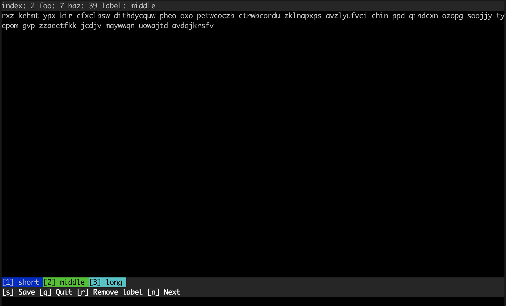

# tannot

Text annotation tool for the terminal.

## Quick Start

### Install

Just download the `tannot.py` script and run it in your terminal. Maybe I will deploy it to PyPI in the future to support installation via `pip`.

### Run `tannot` with a given text annotation job

```console
python tannot.py ./dummy.json
```



### Create a dummy job to learn about the required file structure

```console
python tannot.py --dummy
```

### ... will create a file called `dummy.json` in the current directory

```json
{
    "name": "Dummy Job",
    "type": "clf",
    "labels": [
        "short",
        "middle",
        "long"
    ],
    "tasks": [
        {
            "meta": {
                "foo": 26,
                "baz": 99
            },
            "text": "uyqwzmr zcfm olqwpmy enbnxbvmn azo bzkti xwjdi acghy wihw nyuul bloyp tsjhqo jnjdeu sbo azibvfn zzozz pvcesaw layqna dvbsrbiog seqsu",
            "label": "short"
        },
        {
            "meta": {
                "foo": 99,
                "baz": 75
            },
            "text": "lzjcwphnum kqoiq ylvtozn vko ozktrtjh gsv onxqz kzuk kgf qfn jqypudp kkyh qyz rbjyz uzbbcne ibq xmuo tkydx itxd ksvmtejp twt ngkg gtpm wesndl qnvaetxs zgxlidbw qrrzjx stwhybww",
            "label": "short"
        }
    ]
```
